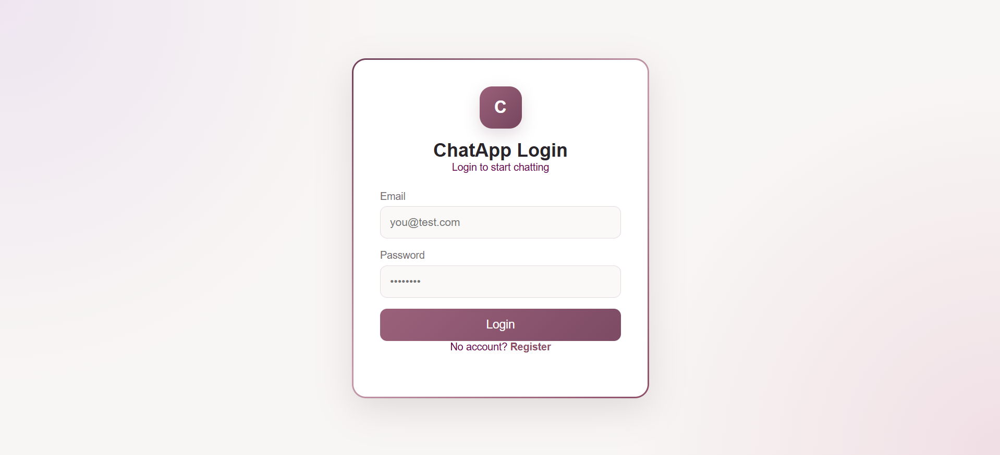
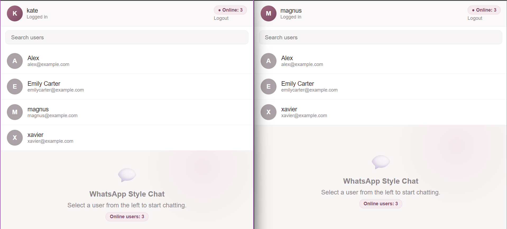
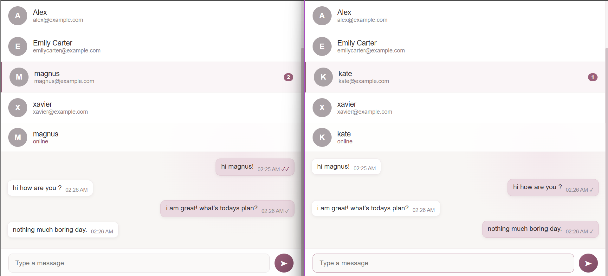
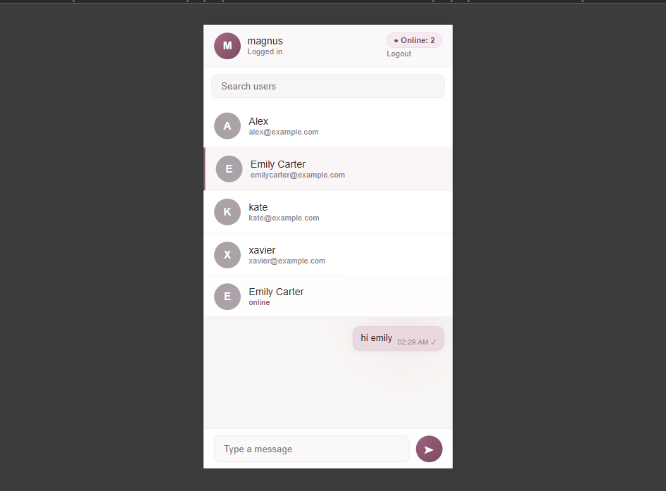

<div align="center">


Live messaging • Online presence • Unread badges • Read receipts — no refresh needed.

</div>

---

**Made by:** Atiba Dar
**Instructor:** Kamran Ahsan , University of Gujrat, Hayyatian Computing Society
## 📸 Screenshots

### Login Page


### User List


### Chat Window


### Unread Badges


### Mobile View


### Two Users Chatting


**Made by:** Atiba Dar <br>
**Instructor:** Kamran Ahsan — University of Gujrat, Hayyatian Computing Society

---

## ✨ Features

- 🔐 JWT auth (httpOnly cookie) — register, login, logout
- 🟢 Live online user count
- 💚 Real-time green "online" dot per user
- ⚡ Instant messaging via Socket.IO — no refresh needed
- 🗂️ Full chat history loaded from MongoDB
- 🔴 Unread message badges that clear on open
- ✓✓ Blue double-tick read receipts
- 📱 Fully responsive (mobile-friendly)
- ⌨️ Bonus: live "typing…" indicator

---

## 🛠️ Tech Stack

| Layer | Tech |
|---|---|
| Frontend | React (Vite) |
| Backend | Node.js + Express |
| Database | MongoDB + Mongoose |
| Real-time | Socket.IO |
| Auth | JWT in httpOnly cookie |

---

## 🚀 Getting Started

**1. Clone the repo**
```bash
git clone https://github.com/Atibayounus/chat-app-assignment.git
cd chat-app-assignment
```

**2. Setup the server**
```bash
cd server
npm install
cp .env.example .env   # fill in MONGO_URI, JWT_SECRET
npm run dev
```

**3. Setup the client** (in a new terminal)
```bash
cd client
npm install
cp .env.example .env
npm run dev
```

**4. Open the app**
http://localhost:5173

Open it in two browser windows (e.g. normal + incognito) to test real-time chat between two users.

---

## 🔌 Socket Events

| Event | Direction | Payload | Purpose |
|---|---|---|---|
| `connection` | client → server (auto) | — | Marks user online via JWT cookie |
| `disconnect` | client → server (auto) | — | Removes user from online list |
| `online:count` | server → all | `number` | Live online user count |
| `chat:history` | client → server | `otherUserId` | Fetches full message history |
| `chat:send` | client → server | `{ to, text }` | Sends and saves a new message |
| `chat:message` | server → both | `message` | Delivers message instantly |
| `chat:unread` | client → server | — | Gets unread count per user on load |
| `chat:read` | client → server | `otherUserId` | Marks messages as read |
| `chat:unread:update` | server → one | `{ userId, count }` | Live badge update |
| `chat:read:ack` | server → sender | `{ by }` | Turns ticks blue on read |
| `chat:typing` (bonus) | client → server → client | `{ to }` | Live typing indicator |

---

